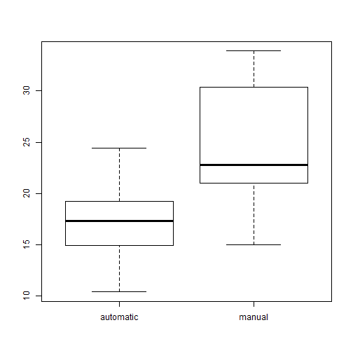
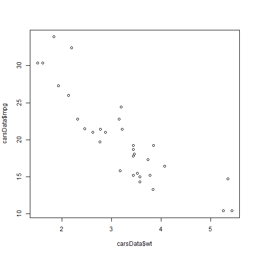

presentation
========================================================
author: Joost Kinkel  
date: februari 5, 2017

MPG as a predictor for weight
========================================================

Acme company is interested in investigating whether transmission-type is a good predictor for MPG for a car.

- Use MtCars dataset
- Supply a decent argumentation whether or not the said statement holds true


Data transformation
========================================================

first use transmission as a factor.


```r
carsData <- mtcars
carsData$am <- as.factor(mtcars$am)
levels(carsData$am) <- c("automatic", "manual")
```


relationship between transmission-type and mpg
========================================================

To get a feel for the relationship, here is a boxplot:




relationship between MPG and weight
========================================================

Intuitively it feels that weight might be a better predictor. Is it so? Let 's look at the relationship between weight and mpg.



Correlation
========================================================

We have a established that there might be a relationship between transmission-type and mpg. But there are more variables at play. How do they influence mpg? Let 's see how all variables correlate to mpg:


```r
cor(mtcars)[1,]
```

```
       mpg        cyl       disp         hp       drat         wt 
 1.0000000 -0.8521620 -0.8475514 -0.7761684  0.6811719 -0.8676594 
      qsec         vs         am       gear       carb 
 0.4186840  0.6640389  0.5998324  0.4802848 -0.5509251 
```

The variable mostly correlated to mpg is wt (weight). This is what one would expect. The heavier a car, the more energy it needs for 1 mile.

